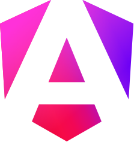

# Chester's portfolio website

[Live Site](https://chester-tejido.github.io)

Built with the following popular libraries:

- {width=2%} [Vue live site](https://chester-tejido.github.io/vue)
- {width=2%} [React live site](https://chester-tejido.github.io/react)
- {width=2%} [Angular live site](https://chester-tejido.github.io/angular)

---

## Color Palette:

- Vue green: #6aad7b
- React blue: #79bcd5
- Angular red: #cd2142
- Background dark: #111112
- Background light: #e0e0e0
- Box shadow: #bebebe

#### Neumorphism light

```css
border-radius: 40px;
background: #e0e0e0;
box-shadow:
	15px 15px 50px #bebebe,
	-15px -15px 50px #ffffff;
```

#### Neumorphism dark

```css
border-radius: 40px;
background: #111112;
box-shadow:
	15px 15px 50px #070707,
	-15px -15px 50px #1b1b1d;
```

---

### Versions

- 0.0.1 initial implementation
